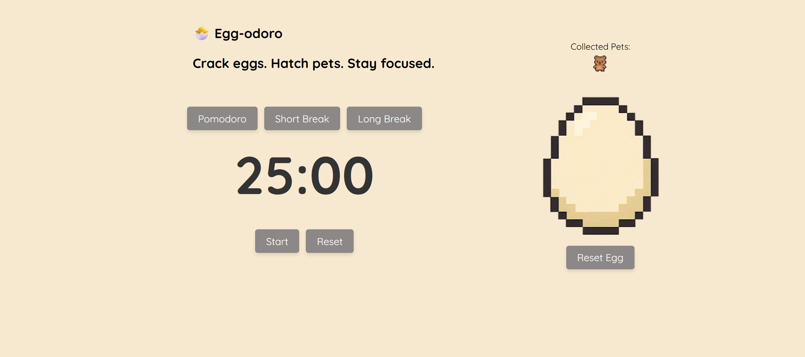

# 🥚 Egg-odoro ⏱️

A Pomodoro productivity timer with a **gamified egg-hatching mechanic**.  
Complete Pomodoro sessions to crack and hatch an egg — collect pets, track your progress, and stay focused!

## 💡 Features

- ⏲️ 25-minute Pomodoro timer
- 🐣 Egg goes from unhatched → cracked → hatched
- 🧸 Random pet collected on hatch
- 🏆 Trophy screen when all 6 pets are collected
- 💾 Progress saved with localStorage
- 🔊 Sound effects for completion and pet hatching

## 🚀 Built With

- React
- JavaScript
- CSS (custom layout, grid, flex)
- LocalStorage API

## 🧪 How to Run

1. Clone the repository  
   `git clone https://github.com/SuperChute/Egg-odoro.git`

2. Install dependencies  
   `npm install`

3. Run the app  
   `npm start`

---

If you found this helpful or fun — star the repo ⭐!

